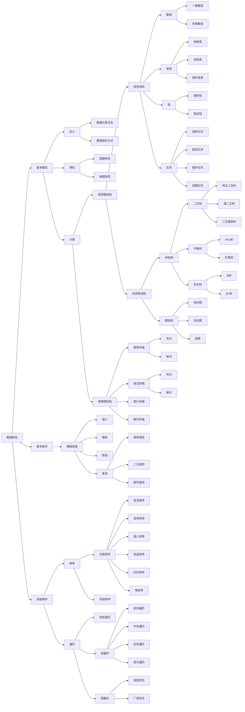

# 数据结构与数据库系统笔记

## 知识体系图

### 数据结构



### 知识点详解

#### 基本概念

##### 定义

数据结构是指相互之间存在一种或多种特定关系的数据元素的集合，包含三方面内容：

- 逻辑结构：数据元素之间的抽象关系
- 存储结构：数据在计算机中的具体存储方式
- 数据运算：施加于数据上的操作集合

##### 特性

###### 逻辑特性

1. 线性结构：元素间呈一对一关系
2. 树形结构：元素间呈一对多关系
3. 图状结构：元素间呈多对多关系
4. 集合结构：元素间无特定关系

###### 物理特性

1. 顺序存储：元素存储在地址连续的存储单元
2. 链式存储：通过指针关联的任意存储单元
3. 索引存储：建立附加索引表定位元素
4. 散列存储：通过哈希函数直接计算存储位置

#### 分类

##### 按逻辑结构

###### 线性结构

- 数组：连续内存空间存储相同类型元素
- 链表：节点通过指针串联的链式结构
- 栈：LIFO（后进先出）操作受限的线性表
- 队列：FIFO（先进先出）操作受限的线性表

###### 非线性结构

- 树结构
  - 二叉树：每个节点最多两个子节点
  - B 树：多路平衡查找树，用于文件系统
  - 红黑树：自平衡二叉查找树
- 图结构
  - 有向图：边带方向性的图结构
  - 无向图：边无方向性的图结构
  - 加权图：边带权值的图结构

##### 按物理结构

- 顺序存储：通过相对位置表示逻辑关系
- 链式存储：通过指针显式表示逻辑关系
- 索引存储：通过索引表快速定位元素
- 散列存储：通过哈希函数建立映射关系

### 基本操作
#### 增删改查
##### 插入
- 数组插入：需移动后续元素，时间复杂度O(n)
- 链表插入：修改相邻节点指针，时间复杂度O(1)
##### 删除
- 顺序删除：类似插入操作，需移动元素
- 链式删除：直接修改前驱节点指针
##### 修改
- 按索引修改：数组O(1)，链表O(n)
- 按值修改：均需遍历查找，O(n)
##### 查找
- 顺序查找：时间复杂度O(n)
- 二分查找：要求有序数组，时间复杂度O(log n)
- 哈希查找：平均O(1)，最坏O(n)

### 高级操作
#### 排序
##### 内部排序
###### 冒泡排序
**算法原理**  
通过相邻元素比较交换，逐步将最大元素移动至末尾  

**算法步骤**  
1. 从第一个元素开始比较相邻元素  
2. 如果前者大于后者则交换位置  
3. 每轮结束后待排序元素减一  
4. 重复直到所有元素有序  

**时间复杂度**  
- 最好：O(n)（已有序情况）  
- 平均：O(n²)  
- 最坏：O(n²)  

**代码实现**  
```c
// 冒泡排序优化版
void bubbleSort(int arr[], int n) {
    int i, j, temp;
    int swapped; // 交换标志
    for (i = 0; i < n-1; i++) {
        swapped = 0;
        for (j = 0; j < n-i-1; j++) {
            if (arr[j] > arr[j+1]) {
                // 交换元素
                temp = arr[j];
                arr[j] = arr[j+1];
                arr[j+1] = temp;
                swapped = 1;
            }
        }
        // 无交换则提前终止
        if (swapped == 0) break;
    }
}
```

###### 快速排序
**分治策略**  
1. 选取基准元素（通常选第一个/中间/随机元素）  
2. 分区操作：将小于基准的放左边，大于的放右边  
3. 递归处理左右子序列  

**时间复杂度**  
- 平均：O(n log n)  
- 最坏：O(n²)（当数组已有序时）  

**优化方案**  
- 三数取中法选择基准  
- 小数组切换插入排序  
- 尾递归优化  

**代码实现**  
```c
// 快速排序分区函数
int partition(int arr[], int low, int high) {
    int pivot = arr[high]; // 选择最后元素为基准
    int i = (low - 1);     // 小于基准的边界索引
    
    for (int j = low; j <= high-1; j++) {
        if (arr[j] < pivot) {
            i++;
            // 交换元素
            int temp = arr[i];
            arr[i] = arr[j];
            arr[j] = temp;
        }
    }
    // 将基准放到正确位置
    int temp = arr[i+1];
    arr[i+1] = arr[high];
    arr[high] = temp;
    return (i + 1);
}

// 快速排序递归实现
void quickSort(int arr[], int low, int high) {
    if (low < high) {
        int pi = partition(arr, low, high);
        quickSort(arr, low, pi - 1);
        quickSort(arr, pi + 1, high);
    }
}
```

###### 堆排序
**算法流程**  
1. 构建最大堆：从最后一个非叶子节点开始调整  
2. 交换堆顶与末尾元素  
3. 调整剩余元素为新堆  
4. 重复步骤2-3直至排序完成  

**时间复杂度**  
- 建堆：O(n)  
- 每次调整：O(log n)  
- 总体：O(n log n)  

**适用场景**  
- 大数据量排序  
- 需要部分排序（如前N大元素）  

**代码实现**  
```c
// 堆调整函数
void heapify(int arr[], int n, int i) {
    int largest = i;        // 初始化最大元素为根
    int left = 2 * i + 1;   // 左子节点
    int right = 2 * i + 2;  // 右子节点

    // 比较左子节点
    if (left < n && arr[left] > arr[largest])
        largest = left;

    // 比较右子节点
    if (right < n && arr[right] > arr[largest])
        largest = right;

    // 如果最大值不是根节点
    if (largest != i) {
        int swap = arr[i];
        arr[i] = arr[largest];
        arr[largest] = swap;
        // 递归调整子堆
        heapify(arr, n, largest);
    }
}

// 堆排序主函数
void heapSort(int arr[], int n) {
    // 构建最大堆（从最后一个非叶子节点开始）
    for (int i = n / 2 - 1; i >= 0; i--)
        heapify(arr, n, i);

    // 逐个提取堆顶元素
    for (int i = n-1; i >= 0; i--) {
        // 移动当前根到末尾
        int temp = arr[0];
        arr[0] = arr[i];
        arr[i] = temp;

        // 调整剩余元素的堆
        heapify(arr, i, 0);
    }
}
```

**算法比较**  
| 排序算法 | 平均时间复杂度 | 空间复杂度 | 稳定性 |  
|---------|--------------|----------|-------|  
| 冒泡排序 | O(n²)        | O(1)     | 稳定  |  
| 快速排序 | O(n log n)   | O(log n) | 不稳定|  
| 堆排序   | O(n log n)   | O(1)     | 不稳定|  
##### 外部排序
- 多路归并：处理大数据集的磁盘排序
- 置换选择：生成初始归并段

#### 遍历
##### 树遍历
- 前序遍历：根节点→左子树→右子树
- 中序遍历：左子树→根节点→右子树  
- 后序遍历：左子树→右子树→根节点
##### 图遍历
- 深度优先(DFS)：栈实现，探索最远节点
- 广度优先(BFS)：队列实现，层层推进
